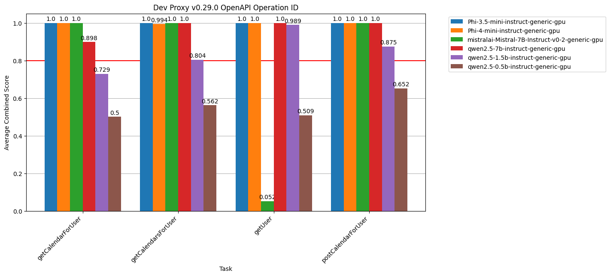
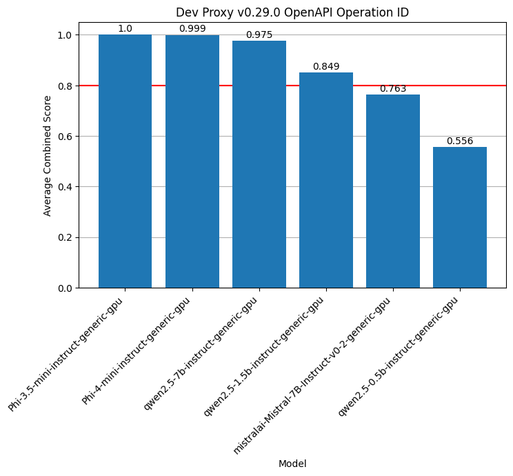

# OpenAI compare

This repo contains a Jupyter notebook to that allows you to compare different language models and see which one gives the best results for the given prompt.





## Features

- Compare different language models.
- Use any language model host that exposes OpenAI-compatible APIs.
- Included code for [Foundry Local](https://learn.microsoft.com/azure/ai-foundry/foundry-local/what-is-foundry-local) and [Ollama](https://ollama.com/).
- Load prompts from [Prompty](https://prompty.ai) files.
- Select from common scoring functions, such as:
  - BLEU
  - ROUGE 1
  - ROUGE 2
  - ROUGE L
  - BERT F
  - BERT R
  - BERT P
  - Edit distance
- Define weighted scores to evaluate the results.
- Cache LLM responses and scores for faster evaluation.
- Compare results in a chart.
- Define threshold to quickly see which models give acceptable results.

## Installation

```sh
uv sync
```

## Structure

- `scoring_functions.py` - contains the definition of the different scoring functions available for you to use.
- `test_*.ipynb` - contains different sample test cases to evaluate.
- `workbench.ipynb` - contains the main notebook to run the tests.

## Usage

1. Define a test case. Best, start from one of the examples.
    1. Specify the title, used in charts.
    1. Specify the test tasks. For each task, define:
        1. Name
        1. One or more reference answers
        1. Prompt
        1. Optionally, temperature or top_p if you want to test them.
    1. Specify the scoring functions and weights to use.
    1. Specify the threshold for the test, to visually indicate acceptable results in the chart.
1. In the `workbench.ipynb` notebook:
    1. Select the language models you want to test.
    1. Choose how many times you want to invoke each prompt (default `20`)
    1. Choose if you want to cache LLM results (default `True`).
    1. Choose if you want to cache score results (default `True`).
    1. Choose if you want to normalize BERT scores. More information in `workbench.ipynb`.
1. Run the notebook.
1. Check the results.
